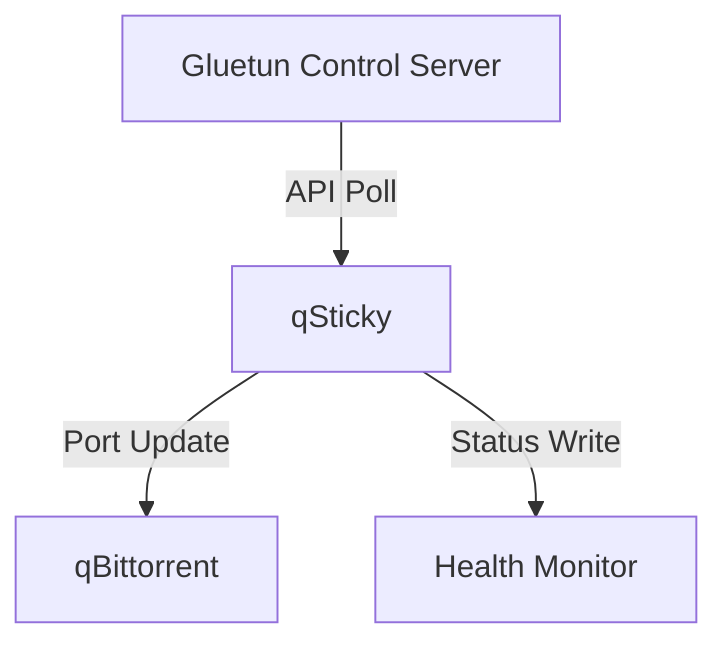

# qSticky

qSticky is an automated port forwarding manager for Gluetun and qBittorrent. It automatically updates qBittorrent's listening port whenever Gluetun receives a new forwarded port.


> [!IMPORTANT]  
> **Gluetun v3.40.1+ API Change:** qSticky now uses Gluetun's new API endpoints (`/v1/portforward`, `/v1/vpn/status`). If you're upgrading from an older version or experiencing 401 errors, you'll need to update your `config.toml` authentication file. See the [Authentication Setup](#authentication-setup) section below for the updated configuration.

## How it Works

qSticky monitors Gluetun's port forwarding through its [control server API](https://github.com/qdm12/gluetun-wiki/blob/main/setup/advanced/control-server.md#openvpn-and-wireguard) and updates qBittorrent's connection settings as needed.

**Port Monitoring**
- Queries Gluetun's control server API endpoint at `/v1/portforward` (Gluetun v3.39.0+)
- Supports both Basic Auth and API Key authentication methods
- Polls the API at configurable intervals (default: 30 seconds)

**Port Management**
When a new port is detected, qSticky retrieves the port number from Gluetun's API, connects to qBittorrent's WebUI API, updates qBittorrent's listening port, and verifies the change was successful.

**Health Monitoring**
qSticky maintains a health status file, checks qBittorrent connectivity regularly, tracks port changes and any errors, and provides Docker health checks.

**Recovery**
The application automatically retries on connection failures, maintains session with qBittorrent, handles network interruptions gracefully, and logs important events and errors.

### Flow


## Quick Start

> [!IMPORTANT]  
> qSticky only supports [VPN providers with native port forwarding integration in Gluetun.](https://github.com/qdm12/gluetun-wiki/blob/main/setup/advanced/vpn-port-forwarding.md#native-integrations) Currently supported providers: **Private Internet Access (PIA)**, **ProtonVPN**, **Perfect Privacy**, and **PrivateVPN**. I recommend using ProtonVPN and my shill link is [here.](https://go.getproton.me/SH1kn)

## Authentication Setup

> [!IMPORTANT]
> **401 Error in qSticky logs?** You need to update your Gluetun `config.toml` file to include the new API endpoints. Follow the configuration examples below to fix authentication issues with Gluetun v3.39.0+.

qSticky requires access to Gluetun's control server API to monitor port forwarding. You need to configure this one of two ways:

> [!NOTE]  
> Authentication is required for qSticky to function. No unauthenticated access is supported, as Gluetun is deprecating unauthenticated endpoints.

### Create Authentication Config
Create a `config.toml` file somewhere to be mapped into gluetun:

```toml
[[roles]]
name = "qSticky"
routes = [
    "GET /v1/portforward",
    "GET /v1/vpn/status"
]
auth = "apikey"
apikey = "your_api_key_here"
```

Or if you prefer basic auth:

```toml
[[roles]]
name = "qSticky"
routes = [
    "GET /v1/portforward",
    "GET /v1/vpn/status"
]
auth = "basic"
username = "myusername"
password = "mypassword"
```

> [!NOTE]
> `/v1/portforward` is required for dynamic port mapping, and `/v1/vpn/status` is required for Gluetun's health status checks.


### Volume mount
Mount the config in your docker-compose.yml:
```yaml
services:
  gluetun:
    # ... other gluetun config ...
    volumes:
      - ./gluetun/config.toml:/gluetun/auth/config.toml  # Mount auth config
```

### qSticky Configuration
Configure qSticky to use the same authentication method:
```yaml
services:
  qSticky:
    # ... other qSticky config ...
    environment:
      # For API Key auth:
      GLUETUN_AUTH_TYPE: apikey
      GLUETUN_APIKEY: your_api_key_here

      # Or for Basic auth:
      # GLUETUN_AUTH_TYPE: basic
      # GLUETUN_USERNAME: myusername
      # GLUETUN_PASSWORD: mypassword
```

For complete details on Gluetun's control server authentication, check out the [official Gluetun documentation.](https://github.com/qdm12/gluetun-wiki/blob/main/setup/advanced/control-server.md#openvpn-and-wireguard)

## Gluetun Setup

Gluetun setup is straightforward. If you're already using it you may just need to add some environment variables:

To set up port forwarding:
1. Enable port forwarding in Gluetun by setting `VPN_PORT_FORWARDING=on`
2. Enable Gluetun's control server with `GLUETUN_HTTP_CONTROL_SERVER_ENABLE=on`
3. Configure authentication (API key or Basic Auth)
4. Ensure qSticky has network access to Gluetun's control server

A working Gluetun configuration might look like:
```yaml
services:
  gluetun:
    image: qmcgaw/gluetun:latest
    container_name: gluetun
    environment:
      VPN_SERVICE_PROVIDER: protonvpn
      VPN_TYPE: wireguard
      VPN_PORT_FORWARDING: on
      GLUETUN_HTTP_CONTROL_SERVER_ENABLE: on
      WIREGUARD_PRIVATE_KEY: 'YOURKEY'
      SERVER_COUNTRIES: Netherlands
    volumes:
      - ./gluetun/config.toml:/gluetun/auth/config.toml
```

> [!NOTE]  
> Since we are using docker compose networking, port `8000` does not need to be explicitly mapped in docker. If you wish to use the API outside of the docker network, you should map the port.

## qSticky Setup

> [!TIP]
> A full list of environment variables are listed and explained below.

To deploy qSticky, add the service to your compose file as so, changing settings as required:
```yaml
services:
  qsticky:
    image: ghcr.io/monstermuffin/qsticky:latest
    container_name: qsticky
    environment:
      # qbittorrent settings
      QBITTORRENT_HOST: gluetun
      QBITTORRENT_HTTPS: false
      QBITTORRENT_PORT: 8080
      # Recommended: API key auth (qBittorrent ≥v5.2.0).
      # If set, username/password below are ignored entirely.
      QBITTORRENT_API_KEY: 'qbt_xxxx'
      # Alternative: username/password (comment out API key above if using user auth)
      # QBITTORRENT_USER: admin
      # QBITTORRENT_PASS: adminadmin
      # gluetun settings
      GLUETUN_HOST: gluetun
      GLUETUN_AUTH_TYPE: apikey
      GLUETUN_APIKEY: your_api_key_here
      # qSticky settings
      LOG_LEVEL: INFO
    healthcheck:
      test: ["CMD", "python3", "-c", "import json; exit(0 if json.load(open('/app/health/status.json'))['healthy'] else 1)"]
      interval: 30s
      timeout: 10s
      retries: 3
    restart: always
```
> [!NOTE]  
> Put qSticky in the same network as gluetun and your host for both gluetun and qBittorrent will be `gluetun`. It is adviced to do this as `container:gluetun` will break the network stack on gluetun restarts.

> [!NOTE]  
> **HTTPS and SSL Certificates**: When using `QBITTORRENT_HTTPS: true`, qSticky defaults to accepting self-signed certificates (`QBITTORRENT_VERIFY_SSL: false`). Set `QBITTORRENT_VERIFY_SSL: true` if you want strict SSL certificate verification.

## qBittorrent Setup

qSticky supports two mutually exclusive authentication methods for qBittorrent:

| Method | Variables | Notes |
|--------|-----------|-------|
| **API key** *(recommended)* | `QBITTORRENT_API_KEY` | qBittorrent ≥v5.2.0. Stateless Bearer token. |
| Username / password | `QBITTORRENT_USER` + `QBITTORRENT_PASS` | Session-cookie based.|

> [!TIP]
> **Use the API key where possible.** If `QBITTORRENT_API_KEY` is set, it is used exclusively, qSticky will **not** fall back to username/password if the key is rejected. Generate a key in qBittorrent → Preferences → WebUI → API Key (requires qBittorrent ≥v5.2.0).

qBittorrent can be deployed like the following example:
```yaml
services:
  qbittorrent:
    container_name: qbittorrent
    image: linuxserver/qbittorrent:latest
    network_mode: container:gluetun
    environment:
      PUID: 1000
      PGID: 1000
      TZ: UTC
      WEBUI_PORT: 8080
    volumes:
      - ./qbittorrent/config:/config
      - ./downloads:/downloads
    restart: always
    healthcheck:
      test: ["CMD-SHELL", "curl -sf https://api.ipify.org || exit 1"]
      interval: 30s
      timeout: 10s
      retries: 3
    depends_on:
      - gluetun
```

> [!NOTE]
> I use the above `healthcheck` to ensure qbittorrent is working. If that check fails, it means qbittorrent can't get out of gluetun's network and marks the container as unhealthy.

## Full Stack Example

Here is a complete example stack for deploying Gluetun, qBittorrent and qSticky:

```yaml
services:
  gluetun:
    container_name: gluetun
    image: qmcgaw/gluetun:latest
    cap_add:
      - NET_ADMIN
    devices:
      - /dev/net/tun:/dev/net/tun
    environment:
      VPN_SERVICE_PROVIDER: protonvpn
      VPN_TYPE: wireguard
      VPN_PORT_FORWARDING: on
      WIREGUARD_PRIVATE_KEY: 'YOURKEY'
      WIREGUARD_ADDRESSES: 'IP'
      SERVER_COUNTRIES: Netherlands
      GLUETUN_HTTP_CONTROL_SERVER_ENABLE: on
    volumes:
      - ./gluetun/config.toml:/gluetun/auth/config.toml
    ports:
      - 8080:8080  # qBittorrent WebUI
    restart: always

  qbittorrent:
    container_name: qbittorrent
    image: linuxserver/qbittorrent:latest
    network_mode: container:gluetun
    environment:
      PUID: 1000
      PGID: 1000
      TZ: UTC
      WEBUI_PORT: 8080
    volumes:
      - ./qbittorrent/config:/config
      - ./downloads:/downloads
    healthcheck:
      test: ["CMD-SHELL", "curl -sf https://api.ipify.org || exit 1"]
      interval: 30s
      timeout: 10s
      retries: 3
    restart: always
    depends_on:
      - gluetun

  qsticky:
    image: ghcr.io/monstermuffin/qsticky:latest
    container_name: qsticky
    environment:
      # qbittorrent settings
      QBITTORRENT_HOST: gluetun
      QBITTORRENT_HTTPS: false
      QBITTORRENT_PORT: 8080
      # Recommended: API key auth (qBittorrent ≥v5.2.0).
      # If set, username/password below are ignored entirely.
      QBITTORRENT_API_KEY: 'qbt_xxxx'
      # Alternative: username/password (comment out API key above if using user auth)
      # QBITTORRENT_USER: admin
      # QBITTORRENT_PASS: 'YOURPASS'
      # gluetun settings
      GLUETUN_HOST: gluetun
      GLUETUN_AUTH_TYPE: apikey
      GLUETUN_APIKEY: 'YOURAPIKEY'
      # qSticky settings
      LOG_LEVEL: INFO
    healthcheck:
      test: ["CMD", "python3", "-c", "import json; exit(0 if json.load(open('/app/health/status.json'))['healthy'] else 1)"]
      interval: 30s
      timeout: 10s
      retries: 3
    restart: always
```

## Configuration

All configuration is done through environment variables:

| Environment Variable | Description | Default |
|---------------------|-------------|---------|
| QBITTORRENT_HOST | qBittorrent server hostname | gluetun |
| QBITTORRENT_PORT | qBittorrent server port | 8080 |
| QBITTORRENT_USER | qBittorrent username (used only when `QBITTORRENT_API_KEY` is not set) | admin |
| QBITTORRENT_PASS | qBittorrent password (used only when `QBITTORRENT_API_KEY` is not set) | adminadmin |
| QBITTORRENT_API_KEY | qBittorrent API key (≥v5.2.0). When set, used exclusively | "" |
| QBITTORRENT_HTTPS | Use HTTPS for qBittorrent connection | false |
| QBITTORRENT_VERIFY_SSL | Verify SSL certificates for HTTPS connections | false |
| CHECK_INTERVAL | API check interval in seconds | 30 |
| LOG_LEVEL | Logging level (DEBUG, INFO, ERROR, WARNING) | INFO |
| GLUETUN_HOST | Gluetun control server hostname | gluetun |
| GLUETUN_PORT | Gluetun control server port | 8000 |
| GLUETUN_AUTH_TYPE | Gluetun authentication type (basic/apikey) | apikey |
| GLUETUN_USERNAME | Gluetun basic auth username | "" |
| GLUETUN_PASSWORD | Gluetun basic auth password | "" |
| GLUETUN_APIKEY | Gluetun API key | "" |

## Verification

To verify qSticky is working:

- Check qSticky logs with `docker logs qsticky`
- Verify qSticky can connect to Gluetun's control server (check logs for API connection messages)
- Confirm the port is being updated in qBittorrent's settings
- Test the Gluetun API endpoint directly using curl (if port 8000 is exposed):
  
  ```bash
  # For API key auth:
  curl -H "X-API-Key: your_api_key" http://localhost:8000/v1/portforward
  
  # For Basic auth:
  curl -u username:password http://localhost:8000/v1/portforward
  ```

When successful, the logs will look something like:

```bash
qsticky - INFO - Starting qSticky port manager...
qsticky - INFO - qBittorrent auth: API key
qsticky - INFO - Port change needed: 54219 -> 45720
qsticky - INFO - Successfully updated port to 45720
qsticky - INFO - Initial status - Gluetun: ✓, qBit: ✓, Port: 45720
```

## Health Monitoring

qSticky includes Docker health checks and maintains a health status file at `/app/health/status.json`. The health status provides detailed, per-service monitoring to help diagnose issues:

### Health Status File Structure

```json
{
  "healthy": true,
  "services": {
    "gluetun": {
      "connected": true,
      "status": "ok",
      "port": 55000,
      "last_check": "2025-06-20T10:00:00.000000",
      "last_error": null,
      "last_success": "2025-06-20T10:00:00.000000"
    },
    "qbittorrent": {
      "connected": true,
      "status": "ok",
      "port": 55000,
      "port_synced": true,
      "last_check": "2025-06-20T10:00:00.000000",
      "last_error": null,
      "last_success": "2025-06-20T10:00:00.000000"
    }
  },
  "current_port": 55000,
  "uptime": "0:05:30.123456",
  "last_check": "2025-06-20T10:00:00.000000",
  "last_port_change": "2025-06-20T09:00:00.000000",
  "last_successful_sync": "2025-06-20T10:00:00.000000",
  "last_error": null,
  "timestamp": "2025-06-20T10:00:00.000000"
}
```

### Top-level Fields

| Field | Description |
|-------|-------------|
| `healthy` | Overall health: `true` only if both services are connected AND ports are synced |
| `current_port` | The forwarded port from Gluetun (the source of truth) |
| `last_check` | Timestamp of the last polling cycle (updated on every check) |
| `last_port_change` | Timestamp when the port was last changed in qBittorrent |
| `last_successful_sync` | Timestamp when ports were last confirmed to be in sync |
| `last_error` | The most recent error message (if any) |
| `uptime` | Time since qSticky started |
| `timestamp` | When this status was written |

### Per-Service Fields (`services.gluetun`, `services.qbittorrent`)

| Field | Description |
|-------|-------------|
| `connected` | Whether the service is reachable and responding |
| `status` | Detailed status: `ok`, `error`, `auth_failed`, `port_mismatch`, or `unknown` |
| `port` | The port reported by this service |
| `port_synced` | (qBittorrent only) Whether qBittorrent's port matches Gluetun's |
| `last_check` | Timestamp of the last check for this specific service |
| `last_error` | The last error from this service (if any) |
| `last_success` | Timestamp of the last successful communication with this service |

### Status Values and Troubleshooting

| Status | Service | Meaning | Troubleshooting |
|--------|---------|---------|-----------------|
| `ok` | Both | Everything working normally | — |
| `error` | Gluetun | Failed to get forwarded port (network issue, Gluetun down, or API error) | Check Gluetun logs and container health |
| `auth_failed` | Gluetun | Authentication to Gluetun API failed | Verify `GLUETUN_AUTH_TYPE`, `GLUETUN_APIKEY` or username/password |
| `error` | qBittorrent | Failed to connect or get/set port | Check qBittorrent is running and reachable at the configured host/port |
| `auth_failed` | qBittorrent | qBittorrent rejected credentials (API key or username/password) | Verify `QBITTORRENT_API_KEY` or `QBITTORRENT_USER`/`QBITTORRENT_PASS` |
| `port_mismatch` | qBittorrent | Port update was sent but verification showed a different port | Check qBittorrent isn't overriding the port via another mechanism |
| `unknown` | Both | Service hasn't been checked yet | Wait for the next polling cycle |

### Docker Health Check

The Docker health check uses `/app/health/status.json`:
```yaml
healthcheck:
  test: ["CMD", "python3", "-c", "import json; exit(0 if json.load(open('/app/health/status.json'))['healthy'] else 1)"]
  interval: 30s
  timeout: 10s
  retries: 3
```

The container will be marked as unhealthy if:
- Gluetun cannot be reached or fails to return a port
- qBittorrent authentication fails or is unreachable
- Port updates fail verification
- Ports remain out of sync across polling cycles

## Support
If you find qSticky useful and want to support me, here are some completely optional ways to do so:

### ProtonVPN
If you're looking for a VPN service that works great with qSticky, I can highly recommend [ProtonVPN](https://go.getproton.me/SH1kn) (referral link). ProtonVPN has excellent port forwarding support and works seamlessly with Gluetun (hence this project existing!)

### Ko-fi
[](https://ko-fi.com/muffn_)

Cheers!